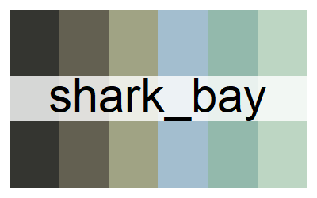

```{r, include = FALSE}
knitr::opts_chunk$set(
  collapse = TRUE,
  comment = "#>",
  echo = TRUE
)
library(colRoz)
```

<center>
{height=200}
</center>

Australia is beautiful. These are palettes based on Australian scenes.

```{r ozpla}
names(oz_palettes$landscapes) # See all palette names
```


# The palettes

{height=200}
{height=200}
{height=200}
{height=200}  

{height=200}
{height=200}
{height=200}
{height=200}
{height=200}
{height=200}
{height=200}
