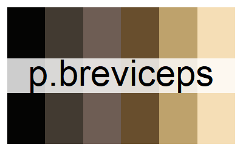
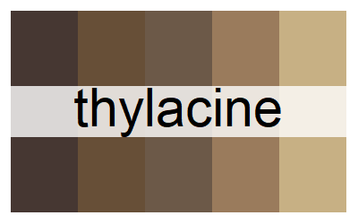

```{r setup, echo=FALSE}
htmltools::img(src=knitr::image_uri("images/colRoz_logo_v2.png"), style = "position:absolute; top:0; right:0", height=150)

knitr::opts_chunk$set(
  collapse = TRUE,
  comment = NA,
  echo = TRUE
)
library(colRoz)
```

# Palette names
```{r ozpla}
names(oz_palettes$mammals)
```

***
# Palette photos

{height=200}
{height=200}  

{height=200}
{height=200}  
